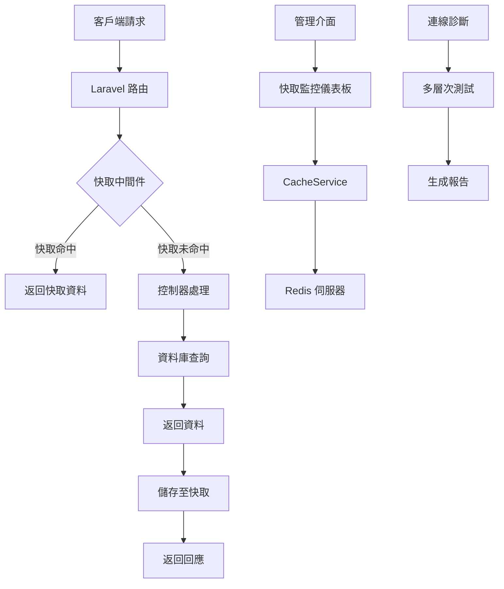

# Laravel Redis 快取管理系統

[](https://laravel.com)
[](https://php.net)
[](https://redis.io)

## 專案說明

Laravel Redis 快取管理系統是一個針對 Laravel 應用程式優化的快取管理解決方案，專為提升 API 效能和資源使用效率而設計。本系統透過智能快取策略、全面的監控工具和靈活的管理介面，幫助開發者充分利用 Redis 的高效能特性，同時簡化快取管理流程。

### 核心特點

- **智能 API 快取**：自動識別並快取 API 請求，大幅減少資料庫負載
- **即時監控面板**：提供直覺化的快取使用情況監控和分析
- **標籤式快取管理**：支援按資源類型或關聯性批次管理快取
- **多層診斷工具**：全面檢測 Redis 連線問題，提供精準解決方案
- **效能優化工具**：包含快取預熱、選擇性更新等進階功能

### 適用場景

- 高流量 API 服務
- 資料密集型 Web 應用
- 多伺服器部署環境
- 需要精細快取控制的系統

## 專案架構

本系統採用模組化設計，主要由以下幾個核心模組組成：

### 1. 快取中介層

```
API 請求 → CacheRequestFingerprint 中間件 → 控制器/資料庫 → 回應
```

- 負責攔截 API 請求並生成唯一指紋
- 根據指紋檢查快取是否存在
- 為回應添加快取狀態標頭
- 智能決定快取策略和過期時間

### 2. 監控與分析模組

```
Redis 伺服器 → CacheService → 監控控制器 → 儀表板視圖
```

- 收集並分析快取使用統計資料
- 監控 Redis 伺服器健康狀態
- 生成視覺化報表和趨勢圖
- 提供即時效能指標

### 3. 快取管理模組

```
管理介面 → CacheManagementController → TaggedCacheService → Redis
```

- 提供標籤式快取清除功能
- 支援選擇性更新快取內容
- 實現快取預熱和批次操作
- 管理快取生命週期

### 4. 連線診斷模組

```
診斷請求 → RedisConnectionTester → 多層測試 → 診斷報告
```

- 執行多層次連線測試
- 檢查環境配置和依賴項
- 識別連線問題根源
- 提供具體解決方案建議

### 系統流程圖



### 目錄結構

```
app/
├── Http/
│   ├── Controllers/
│   │   ├── CacheMonitorController.php
│   │   ├── CacheManagementController.php
│   │   └── RedisConnectionTestController.php
│   └── Middleware/
│       └── CacheRequestFingerprint.php
├── Services/
│   ├── CacheService.php
│   ├── TaggedCacheService.php
│   └── RedisConnectionTester.php
├── Console/
│   └── Commands/
│       ├── CachePrewarm.php
│       └── CacheAnalytics.php
resources/
├── views/
│   ├── admin/
│   │   ├── cache-monitor.blade.php
│   │   └── redis-test.blade.php
│   └── components/
│       ├── cache-stats-card.blade.php
│       └── redis-connection-status.blade.php
public/
└── js/
    └── cache-dashboard.js
```

## 安裝方式

### 系統需求

- PHP 8.2+
- Laravel 11.x
- Redis 伺服器 7.0+
- Composer 2.0+
- Node.js 18+ (用於前端資源編譯)

### 安裝步驟

#### 1. 取得專案

```bash
# 複製專案
git clone https://github.com/your-username/laravel-redis-cache-manager.git

# 進入專案目錄
cd laravel-redis-cache-manager
```

#### 2. 安裝相依套件

```bash
# 安裝 PHP 相依套件
composer install

# 安裝前端相依套件
npm install

# 編譯前端資源
npm run build
```

#### 3. 環境設定

```bash
# 複製環境設定檔
cp .env.example .env

# 生成應用程式金鑰
php artisan key:generate
```

編輯 `.env` 檔案，設定 Redis 連線參數：

```
CACHE_DRIVER=redis
REDIS_HOST=127.0.0.1
REDIS_PASSWORD=null
REDIS_PORT=6379
REDIS_CLIENT=phpredis
```

#### 4. 資料庫設定

```bash
# 執行資料庫遷移
php artisan migrate

# (選用) 填入初始資料
php artisan db:seed
```

#### 5. 啟動服務

```bash
# 啟動開發伺服器
php artisan serve
```

#### 6. 設定排程任務 (選用)

將以下行添加到伺服器的 Cron 任務中：

```
* * * * * cd /path-to-your-project && php artisan schedule:run >> /dev/null 2>&1
```

### 快速設定指南

1. **啟用 API 快取中間件**

   編輯 `app/Http/Kernel.php` 檔案：

   ```php
   protected $middlewareGroups = [
       'api' => [
           // 其他中間件...
           \App\Http\Middleware\CacheRequestFingerprint::class,
       ],
   ];
   ```

2. **設定快取過期策略**

   編輯 `config/cache.php` 檔案：

   ```php
   'ttl' => [
       'api' => [
           'default' => 600, // 10 分鐘
           'products' => 3600, // 1 小時
           'users' => 300, // 5 分鐘
       ]
   ],
   ```

3. **啟用快取分析**

   ```bash
   php artisan cache:analytics --enable
   ```

4. **設定管理員權限** (選用)

   ```bash
   php artisan cache:admin-setup
   ```

## 使用指南

### 快取監控儀表板

訪問 `/admin/cache-monitor` 路徑查看快取監控儀表板：

- **即時統計**：查看命中率、記憶體使用量等關鍵指標
- **伺服器狀態**：監控 Redis 伺服器連線狀態
- **快取管理**：執行清除或預熱操作

### Redis 連線測試

訪問 `/redis-test` 路徑執行連線診斷：

- **全面檢測**：從網路層到應用層進行多層次測試
- **問題識別**：自動識別常見連線問題
- **解決方案**：提供針對性的解決建議

### API 快取使用

API 快取功能自動運作，無需額外設定。您可以透過檢查回應標頭來確認快取狀態：

- `X-API-Cache: HIT` - 回應來自快取
- `X-API-Cache: MISS` - 回應新生成並已儲存至快取

### 標籤式快取管理

使用標籤式快取清除功能：

```php
// 在控制器中
public function updateProduct($id)
{
    // 更新產品...
    
    // 清除相關快取
    app(TaggedCacheService::class)->clearCacheByTag('product:' . $id);
    
    return response()->json(['message' => '產品已更新，相關快取已清除']);
}
```

### 快取預熱

執行快取預熱命令：

```bash
# 預熱所有產品快取
php artisan cache:prewarm --resource=products

# 預熱特定路由快取
php artisan cache:prewarm --route=api/v1/popular-items
```

## 效能優化建議

1. **調整快取過期時間**：根據資料變更頻率設定合適的過期時間
2. **使用標籤關聯**：為相關資源設定相同標籤，方便批次管理
3. **定期監控**：關注命中率和記憶體使用情況，及時調整策略
4. **設定記憶體限制**：在 Redis 配置中設定合理的記憶體上限
5. **啟用快取預熱**：對高頻訪問資源進行預熱，避免冷啟動問題

透過本系統，您可以顯著提升應用程式效能，減少資料庫負載，並獲得更好的使用者體驗。