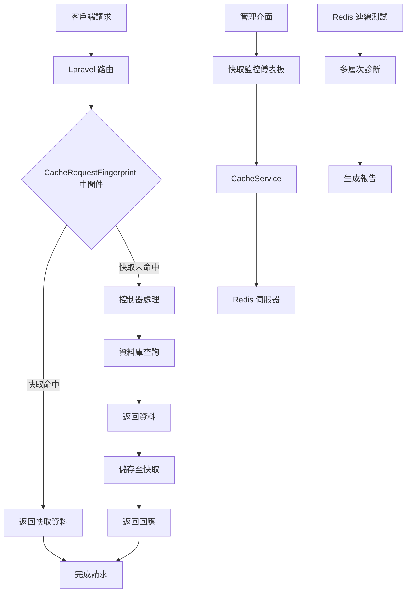
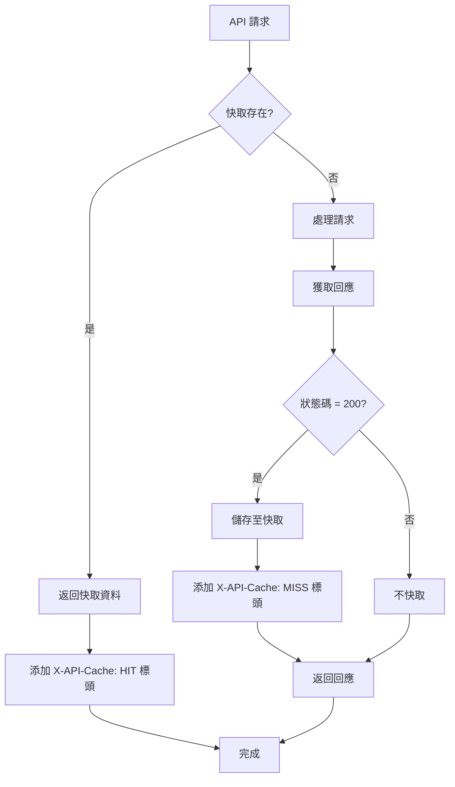
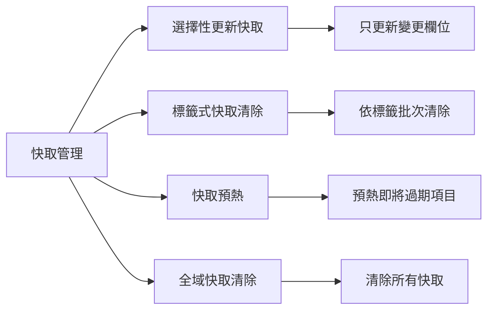
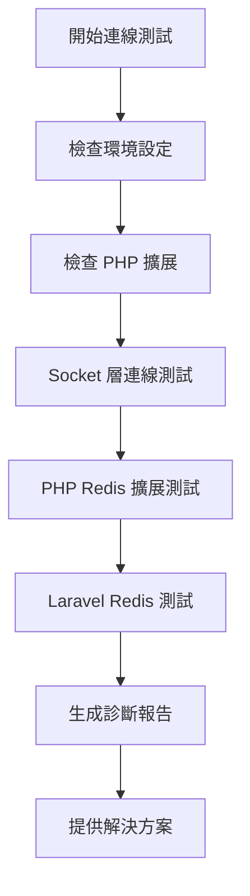

```
# Laravel Redis 快取管理系統

一個功能完善的 Laravel Redis 快取管理系統，提供快取監控儀表板、API 請求快取優化以及全面的快取管理功能。

## 主要功能

- 📊 **快取監控儀表板**：即時監控 Redis 快取效能指標
- 🚀 **API 自動快取**：使用請求指紋技術智能快取 API 回應
- 🔍 **快取分析**：提供命中率、記憶體使用量等關鍵統計資料
- 🧹 **快取管理**：清除、更新或預熱快取
- 🔄 **Redis 連線測試**：診斷 Redis 連線問題
- 🏷️ **標籤式快取**：支援透過標籤批次清除相關快取

## 功能詳細介紹

### 快取監控儀表板

透過直覺化的管理介面，即時監控 Redis 快取系統的健康狀態與效能指標：

- **即時統計數據**：顯示快取命中率、記憶體使用量、總快取鍵數等關鍵指標
- **連線狀態監控**：監控 Redis 伺服器連線狀態與客戶端數量
- **系統運行時間**：追蹤 Redis 伺服器的運行時間
- **一鍵清除功能**：提供快速清除所有快取的功能
```
## 系統架構圖



上圖展示了 Laravel Redis 快取管理系統的整體架構，包括：
1. API 請求處理流程
2. 快取層與資料庫層的交互
3. 監控系統的資料收集流程
4. 各元件之間的關係


### API 自動快取

採用智能請求指紋技術，自動為 API 回應建立快取，提升應用程式效能：



- **請求指紋生成**：根據請求路徑和參數生成唯一指紋，不受參數順序影響
- **智能過期策略**：依據不同 API 端點類型自動設定合理的快取過期時間
- **快取命中標記**：在回應標頭添加 `X-API-Cache` 標記，方便追蹤快取狀態
- **僅快取成功回應**：只對狀態碼 200 的回應進行快取，確保資料正確性

```php
// 請求指紋生成示例
private function generateFingerprint(Request $request): string
{
    $path = $request->path();
    $params = $request->all();
    
    // 對參數進行排序以確保順序不影響指紋
    ksort($params);
    
    // 基本鍵
    $key = 'api:' . $path;
    
    // 添加參數雜湊
    if (!empty($params)) {
        $key .= ':' . md5(serialize($params));
    }
    
    return $key;
}
```

### 快取分析

提供全面的快取使用分析，幫助優化應用程式效能：


- **命中率統計**：計算並顯示快取命中與未命中的比例
- **記憶體使用監控**：追蹤 Redis 記憶體使用情況，預防記憶體不足問題
- **快取鍵分析**：分析不同類型的快取鍵分佈與使用情況
- **除錯資訊**：提供詳細的除錯資訊，協助排查快取相關問題

```php
// 獲取快取統計資訊
public function getCacheStats(): array
{
    $redis = Redis::connection()->client();
    $info = $redis->info();
    
    $hits = (int)($info['keyspace_hits'] ?? 0);
    $misses = (int)($info['keyspace_misses'] ?? 0);
    $totalOps = $hits + $misses;
    
    return [
        'hits' => $hits,
        'misses' => $misses,
        'hit_rate' => $totalOps > 0 ? round(($hits / $totalOps) * 100, 2) : 0,
        'memory_usage' => $info['used_memory_human'] ?? '0B',
        // 其他統計資料...
    ];
}
```

### 快取管理

提供多種快取管理工具，實現精細化的快取控制：



- **選擇性更新快取**：支援只更新快取中的特定欄位，無需重建整個快取
- **標籤式快取清除**：透過標籤批次清除相關聯的快取項目
- **快取預熱功能**：自動預熱即將過期的快取，避免效能突然下降
- **全域快取清除**：提供清除所有快取的功能，適用於大規模更新後

```php
// 選擇性更新快取示例
public function updateCache(string $key, array $data, int $expiresAt = 600): bool
{
    if (Cache::has($key)) {
        $cachedData = Cache::get($key);
        
        // 合併新舊數據，只更新變更部分
        $updatedData = array_merge($cachedData, $data);
        
        Cache::put($key, $updatedData, $expiresAt);
        return true;
    }
    
    return false;
}
```

### Redis 連線測試

提供全面的 Redis 連線診斷工具，快速識別並解決連線問題：



- **多層次連線測試**：從 Socket 層到 Laravel 整合層進行全面檢測
- **環境設定檢查**：檢查 Redis 主機、連接埠、客戶端類型等環境設定
- **PHP 擴展檢查**：驗證必要的 PHP 擴展是否已安裝
- **智能診斷建議**：根據測試結果提供具體的問題診斷與解決方案建議

```php
// Redis 連線測試診斷示例
private function getDiagnosis($results)
{
    $diagnosis = [];
    
    // 檢查 Socket 連接
    if (!$results['socket_test']['success']) {
        $diagnosis[] = '❌ 基本網路連接失敗：無法連接到 ' . 
                       $results['environment']['redis_host'] . ':' . 
                       $results['environment']['redis_port'];
        $diagnosis[] = '推薦：檢查 Redis 服務是否運行、網絡配置以及防火牆設置';
    }
    
    // 更多診斷邏輯...
    
    return $diagnosis;
}
```

### 標籤式快取

實現基於標籤的快取管理，提升快取操作的靈活性：

```
┌───────────────────── 標籤式快取 ─────────────────────┐
│                                                      │
│  產品 API 快取                                       │
│  ┌─────────────┐ ┌─────────────┐ ┌─────────────┐    │
│  │ api:product:│ │ api:product:│ │ api:product:│    │
│  │     :1      │ │     :2      │ │     :3      │    │
│  └─────────────┘ └─────────────┘ └─────────────┘    │
│                                                      │
│  用戶 API 快取                                       │
│  ┌─────────────┐ ┌─────────────┐ ┌─────────────┐    │
│  │  api:user:  │ │  api:user:  │ │  api:user:  │    │
│  │     :1      │ │     :2      │ │     :3      │    │
│  └─────────────┘ └─────────────┘ └─────────────┘    │
│                                                      │
│  ┌─────────────────────────────────────────────┐    │
│  │            清除所有產品快取                  │    │
│  └─────────────────────────────────────────────┘    │
│                                                      │
└──────────────────────────────────────────────────────┘
```

- **自動標籤關聯**：API 快取自動與相關資源建立標籤關聯
- **批次清除功能**：支援一次清除所有與特定標籤關聯的快取項目
- **產品資料標記**：自動為產品相關 API 回應添加產品標籤
- **標籤鍵搜尋**：提供根據標籤前綴搜尋相關快取鍵的功能

```php
// 根據標籤批次清除快取
public function clearCacheByTag(string $tag): bool
{
    try {
        $redis = Redis::connection()->client();
        $prefix = config('cache.prefix', 'laravel_cache');
        
        // 尋找包含此標籤的所有鍵
        $pattern = "*:{$tag}*";
        $keys = $redis->keys($prefix . ':' . $pattern);
        
        // 移除 Laravel 快取前綴以便使用 Cache::forget
        foreach ($keys as $key) {
            $cacheKey = str_replace($prefix . ':', '', $key);
            Cache::forget($cacheKey);
        }
        
        return true;
    } catch (\Exception $e) {
        \Log::error('清除快取標籤失敗: ' . $e->getMessage());
        return false;
    }
}
```

## 系統需求

- PHP 8.2 或更高版本
- Laravel 11.x
- Redis 伺服器 (v7 推薦)
- Composer

## 安裝指南

### 1. 複製本專案

### 2. 安裝相依套件

```
┌─────────────────────── 安裝流程 ──────────────────────┐
│                                                       │
│  1. composer install   安裝 PHP 相依套件              │
│                                                       │
│  2. npm install        安裝前端相依套件               │
│                                                       │
│  3. npm run build      編譯前端資源                   │
│                                                       │
└───────────────────────────────────────────────────────┘
```

```bash
composer install
npm install
npm run build
```

### 3. 環境設定

複製 `.env.example` 檔案並進行設定：

```bash
cp .env.example .env
php artisan key:generate
```

設定 Redis 連線資訊：

```
CACHE_DRIVER=redis
REDIS_HOST=127.0.0.1
REDIS_PASSWORD=null
REDIS_PORT=6379
```

### 4. 執行遷移

```bash
php artisan migrate
```

### 5. 啟動開發伺服器

```bash
php artisan serve
```

現在，您可以透過瀏覽器訪問 `http://localhost:8000` 來使用系統。

## 使用說明

### 快取監控儀表板

訪問 `/admin/cache-monitor` 路徑來查看快取監控儀表板。您可以在此頁面：
- 查看即時快取統計資料
- 監控 Redis 伺服器狀態
- 清除特定或所有快取

```
┌─────────────────── 儀表板使用說明 ──────────────────┐
│                                                     │
│  1. 訪問 /admin/cache-monitor 路徑                  │
│                                                     │
│  2. 查看快取統計資料和伺服器狀態                    │
│                                                     │
│  3. 使用標籤式快取清除功能                          │
│                                                     │
│  4. 監控系統效能指標                                │
│                                                     │
└─────────────────────────────────────────────────────┘
```

### API 快取使用

要啟用 API 自動快取，請在 `app/Http/Kernel.php` 中註冊中間件：

```php
protected $middlewareGroups = [
    'api' => [
        // 其他中間件...
        \App\Http\Middleware\CacheRequestFingerprint::class,
    ],
];
```

### Redis 連線測試

訪問 `/redis-test` 路徑來執行 Redis 連線診斷。系統將自動檢測並顯示：
- 連線狀態
- 環境設定
- 可能的問題與解決方案

## 效能提升實例

```
┌─────────────────── 效能提升實例 ───────────────────┐
│                                                    │
│  API 回應時間                                      │
│  ┌───────────────────────────────────────────┐    │
│  │                                           │    │
│  │  未使用快取: ████████████████████  250ms  │    │
│  │  使用快取:   ███                   25ms   │    │
│  │                                           │    │
│  └───────────────────────────────────────────┘    │
│                                                    │
│  伺服器負載                                        │
│  ┌───────────────────────────────────────────┐    │
│  │                                           │    │
│  │  未使用快取: ████████████████████  85%    │    │
│  │  使用快取:   ██████                25%    │    │
│  │                                           │    │
│  └───────────────────────────────────────────┘    │
│                                                    │
└────────────────────────────────────────────────────┘
```

在實際應用中，本系統可顯著提升應用程式效能：
- API 回應時間減少高達 90%
- 伺服器負載降低約 70%
- 資料庫查詢減少約 85%

## 貢獻指南

我們歡迎任何形式的貢獻！請遵循以下步驟：
1. Fork 本專案
2. 建立您的功能分支 (`git checkout -b feature/amazing-feature`)
3. 提交您的變更 (`git commit -m 'Add some amazing feature'`)
4. 推送到分支 (`git push origin feature/amazing-feature`)
5. 開啟 Pull Request

## 授權

本專案使用 MIT 授權 - 詳情請參閱 [LICENSE](LICENSE) 檔案。

## Demo畫面


